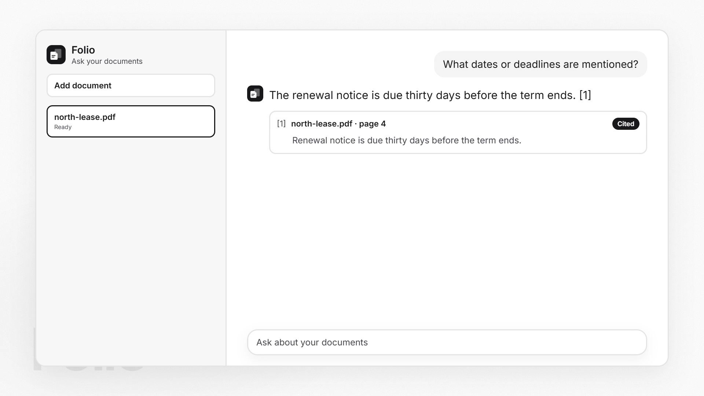

# Folio

Folio is a document question-and-answer app made by [Shivansh Singhal](https://github.com/ShivanshSinghaL06). You upload a PDF or Word file and ask in plain language. Each answer is grounded in retrieved passages and cites the file, and the page or section when the extractor had one.

The public app is at [https://folio-orcin-five.vercel.app](https://folio-orcin-five.vercel.app). A longer write-up of the implementation is in the app at [About](https://folio-orcin-five.vercel.app/about).

[](frontend/public/folio.mp4)

## What it does

You add a `.pdf` or `.docx` file. Older `.doc` files are rejected. A scanned PDF with no text layer fails with a clear error. This version does not run OCR. The file is parsed in the upload request, split into overlapping passages, and stored with a vector embedding and a full-text index.

A question searches the ready documents, or one document you pick in the composer. Hybrid retrieval combines keyword matches and semantic matches, fuses the rankings, reranks the pool, and asks a chat model to answer only from those passages. The Sources cards under the reply show the file name, location, and excerpt. A passage the model marked with `[n]` is labeled Cited. A passage that was retrieved but not marked is labeled Retrieved.

`POST /api/search` runs the same retrieval pipeline and returns the reranked passages without calling the chat model.

## Addresses

| | |
| --- | --- |
| Application | [https://folio-orcin-five.vercel.app](https://folio-orcin-five.vercel.app) |
| About | [https://folio-orcin-five.vercel.app/about](https://folio-orcin-five.vercel.app/about) |
| API | [https://api-production-6381.up.railway.app](https://api-production-6381.up.railway.app) |
| Health | [https://api-production-6381.up.railway.app/api/health](https://api-production-6381.up.railway.app/api/health) |
| OpenAPI | [https://api-production-6381.up.railway.app/docs](https://api-production-6381.up.railway.app/docs) |
| Source | [https://github.com/ShivanshSinghaL06/Folio](https://github.com/ShivanshSinghaL06/Folio) |

The browser talks only to the Vercel site. Requests to `/api` are rewritten to the Railway API, so the page and the API share one public origin. The rewrite is in `frontend/vercel.json`.

Locally, Docker Compose serves the UI at [http://localhost:5173](http://localhost:5173) and the API at [http://localhost:8000](http://localhost:8000). OpenAPI is at [http://localhost:8000/docs](http://localhost:8000/docs).

## Tech stack

- **Interface.** React 18 and TypeScript, built with Vite. The chat layout is a custom interface in the style of [assistant-ui](https://github.com/assistant-ui/assistant-ui). Navigation to `/about` uses the History API. There is no client router package.
- **API.** Python 3.12, FastAPI, and Uvicorn. Pydantic settings read the environment. Alembic applies schema migrations on startup.
- **Database.** PostgreSQL 16 with pgvector. Chunks live in a 1024-dimension vector column. A generated `tsvector` supports full-text search.
- **Models.** Amazon Bedrock. Embeddings use Amazon Titan Text Embeddings V2 (`amazon.titan-embed-text-v2:0`, 1024 dimensions). The live deployment answers with Claude Haiku 4.5 (`us.anthropic.claude-haiku-4-5-20251001-v1:0`) in `ap-southeast-2`. The example environment file uses a different chat model id. Use the id that is enabled in your account.
- **Hosting.** The website is a static Vite build on Vercel. The API and Postgres run as separate services on Railway. The database image is `pgvector/pgvector:pg16`.
- **Local run.** Docker Compose starts Postgres, the API on port 8000, and the web app on port 5173. The same Python code runs on Windows and macOS.

## Tools

- **pypdf** reads PDF text page by page, so a citation can name a page.
- **python-docx** reads Word headings, body text, and table cells. Headings become section titles.
- **boto3** calls Bedrock for embeddings and for the chat completion.
- **SQLAlchemy** and **psycopg** talk to Postgres. The **pgvector** Python package maps the embedding column.
- The lexical pool is selected with PostgreSQL full-text search and `ts_rank_cd`, then rescored with Okapi BM25 (`k1 = 1.5`, `b = 0.75`).
- Vector search is cosine distance on the 1024-dimension embedding.
- Reciprocal rank fusion merges the lexical and vector lists. A local reranker orders the fused candidates. A Bedrock rerank model is optional and unused in the public deployment.
- **pytest** covers chunking, extraction, BM25, fusion, reranking, citations, and the HTTP checks that do not need Postgres or AWS.

## Architecture

```text
PDF / DOCX
    -> text extraction (page for PDF, heading and tables for Word)
    -> overlapping chunks (1,200 characters, 200 overlap)
    -> Amazon Titan Text Embeddings V2
    -> PostgreSQL (pgvector + full-text index)

Question
    -> lexical candidates (PostgreSQL full text, rescored with Okapi BM25)
    -> vector candidates (pgvector cosine)
    -> reciprocal rank fusion (default 20 candidates)
    -> local reranker (top 6)
    -> Amazon Bedrock chat answer
    -> answer plus citations
```

Retrieval, reranking, embeddings, and generation are separate services behind small interfaces in `backend/app/services`. Ingestion lives in `services/ingestion`. HTTP routes for documents, conversations, search, and health live in `backend/app/api/routes`. The React app is in `frontend/src`.

The default reranker is local and does not call Bedrock. Set `BEDROCK_RERANK_MODEL` when you want Bedrock to rerank instead. If that call fails, the API logs the failure and uses the local reranker for that request.

Lexical search is not a claim that PostgreSQL's built-in ranker is Okapi BM25. Full-text search selects the candidate pool and orders it with `ts_rank_cd`. Okapi BM25 then rescores that pool. The pool is at least 50 chunks, or five times the candidate limit. BM25 does not scan every chunk outside the full-text match.

## Path of a document

1. The upload is checked for type and size. The default limit is 15 MB (`MAX_UPLOAD_BYTES`).
2. Text is extracted with page numbers for PDFs, and with heading and table structure for Word files.
3. The text is cut into overlapping chunks. The defaults are 1,200 characters with a 200-character overlap.
4. Each chunk is embedded with Titan Text Embeddings V2 and stored beside its text and a full-text vector.
5. The document stays in the library. A failed file keeps the error instead of disappearing.

## Path of a question

1. The first question in an empty screen creates a conversation. Later questions stay on that chat.
2. Full-text search builds a lexical candidate pool. BM25 rescores that pool.
3. Vector search returns the nearest chunks by cosine distance.
4. Reciprocal rank fusion combines the two rankings. The default candidate count is 20 (`RETRIEVAL_CANDIDATES`).
5. The local reranker keeps the top 6 passages (`RERANK_TOP_K`).
6. Those passages, plus a short slice of chat history, go to the chat model. The prompt asks for an answer that marks supporting passages with `[n]`.
7. The answer and the citations are saved with the conversation.

## What you need to run it locally

- Docker Desktop on Windows or Docker Engine on macOS
- An AWS account with Amazon Bedrock model access for the embedding model and the chat model you set in `.env`
- Optional: a Bedrock rerank model, if you set `BEDROCK_RERANK_MODEL`

The database vector column is fixed at 1024 dimensions, which matches Amazon Titan Text Embeddings V2 at its default size. `BEDROCK_EMBEDDING_DIMENSIONS` must stay `1024` unless you add a migration that changes the column.

## Configure AWS Bedrock

1. In the Bedrock console, enable the embedding model and the chat model for your region.
2. Copy the example environment file:

```text
copy .env.example .env
```

On macOS or Linux:

```text
cp .env.example .env
```

3. Set `AWS_REGION` to the region where those models are enabled.
4. Authenticate in one of these ways:
   - Set `AWS_ACCESS_KEY_ID` and `AWS_SECRET_ACCESS_KEY`.
   - Leave both empty and use the AWS credential chain already on the machine (an instance role, or credentials exported in the shell).
   - Leave both empty and set `AWS_BEARER_TOKEN_BEDROCK`. boto3 reads that variable from the process environment. A short-term Bedrock API key expires, often within 12 hours.
5. Set the model ids. The example values are:

```text
BEDROCK_EMBEDDING_MODEL=amazon.titan-embed-text-v2:0
BEDROCK_CHAT_MODEL=us.anthropic.claude-sonnet-4-6
```

Use the model ids that are actually enabled in your account. A cross-region inference profile id is valid when that is how the model is published in your region. The public deployment uses `us.anthropic.claude-haiku-4-5-20251001-v1:0`.

6. Leave `BEDROCK_RERANK_MODEL` empty to use the local reranker. To rerank with Bedrock, set it to a rerank model you can invoke, for example `cohere.rerank-v3-5:0`.

Do not commit `.env`. It is gitignored.

## Database

PostgreSQL with the `pgvector` extension stores documents, chunks, embeddings, a generated `tsvector`, conversations, and messages. The API applies `backend/alembic` migrations on startup inside Docker.

Compose creates a database named `search` with user `search` and password `search`, and points the API at `db:5432`. The `DATABASE_URL` in `.env` is for running the API on the host, where the database is on `localhost`. Compose overrides that URL for the `api` service.

Data lives in the `pgdata` volume. `docker compose down` keeps it. `docker compose down -v` deletes it.

## Run with Docker

From this directory, after `.env` exists:

```text
docker compose up --build
```

- Web UI: http://localhost:5173
- About: http://localhost:5173/about
- API: http://localhost:8000
- OpenAPI: http://localhost:8000/docs

The web container proxies `/api` to the API, so the browser talks to one origin.

## Run on the host

Use this when you want a local reload cycle. Start only the database from Compose, then run the API and the web app yourself. Commands below are for Windows PowerShell. On macOS or Linux, activate the virtualenv with `source .venv/bin/activate` and use `python3` if `python` is not Python 3.11+.

```text
docker compose up db -d
cd backend
python -m venv .venv
.venv\Scripts\python -m pip install -e ".[dev]"
.venv\Scripts\python -m alembic upgrade head
.venv\Scripts\python -m uvicorn app.main:app --reload --port 8000
```

In another terminal:

```text
cd frontend
npm install
npm run dev
```

Open http://localhost:5173. The Vite dev server proxies `/api` to port 8000.

## Use the application

1. Add a `.pdf` or `.docx` file. Older `.doc` files are rejected. The file is parsed immediately.
2. PDF text is taken page by page, so citations can name a page. Word headings become section titles, and table cells are indexed.
3. Start a chat, or just ask. The first question creates a chat. You can search every ready document or one document.
4. The answer is saved with the conversation. The Sources column lists the passages that were retrieved.
5. Remove a document or a chat from the library. Removing a document deletes its chunks.

## Tests

From `backend`, with the virtualenv above:

```text
.venv\Scripts\python -m pytest
```

On macOS or Linux:

```text
pytest
```

The tests cover chunking, Word extraction, upload validation, BM25, reciprocal rank fusion, both rerankers, citation formatting, the retrieval pipeline, the no-match answer path, and the HTTP checks that do not need PostgreSQL or AWS. They do not call Bedrock and they do not start a database.

## Project layout

```text
Folio/
├── backend/
│   ├── app/
│   │   ├── api/
│   │   ├── core/
│   │   ├── db/
│   │   ├── models/
│   │   ├── schemas/
│   │   ├── services/
│   │   │   ├── ingestion/
│   │   │   ├── embeddings/
│   │   │   ├── retrieval/
│   │   │   ├── reranking/
│   │   │   └── generation/
│   │   ├── main.py
│   │   └── runtime.py
│   ├── alembic/
│   └── tests/
├── frontend/
├── docker-compose.yml
├── .env.example
└── README.md
```

## Hosting

Vercel serves the static frontend. Railway runs two services: the FastAPI process and Postgres with pgvector. `frontend/vercel.json` sends `/api/*` to the Railway API and sends `/about` to `index.html` so a refresh on that path still loads the app.

The API listens on the platform `PORT` (Railway injects `8080`). Local Docker still uses port `8000`.

## Limits

- Embeddings and answers require Bedrock credentials and model access. Search and chat return an error the UI can show when Bedrock rejects the call. The failed document stays in the library with that error.
- A short-term Bedrock API key stops working when it expires. Replace `AWS_BEARER_TOKEN_BEDROCK` and restart the API.
- Upload size defaults to 15 MB (`MAX_UPLOAD_BYTES`). Vercel's own function body limit does not apply to these uploads, because the file goes through the rewrite to Railway.
- Ingestion runs in the upload request. Very large files wait on that request instead of a background worker.
- The lexical pool is the top full-text matches. BM25 rescores that pool. It is not a scan of every chunk for every query term outside the full-text match.
- Changing the embedding dimension requires a new migration. The running process refuses to start if `BEDROCK_EMBEDDING_DIMENSIONS` is not 1024.
